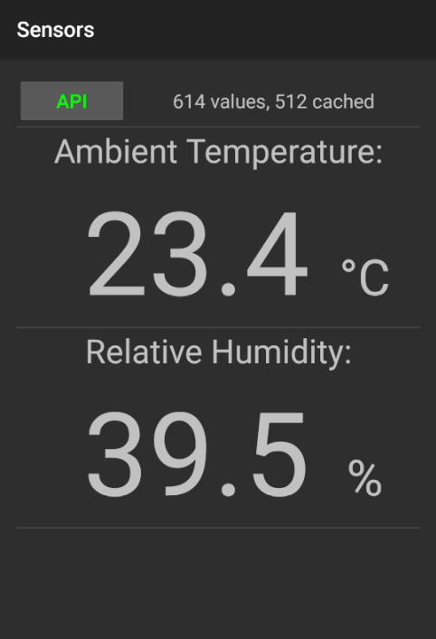

# android-sensors

Simple Android application that tracks and displays some basic hardware sensors. Sensor readings are uploaded in background to a remote database via REST API client which in case of upload failure stores them in a local SQLite database. This initial proof-of-concept version requires a button press for upload of cached readings for debugging purposes.

